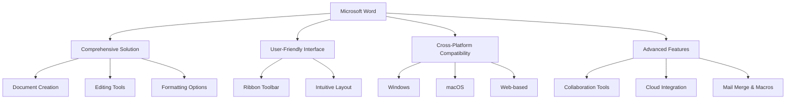
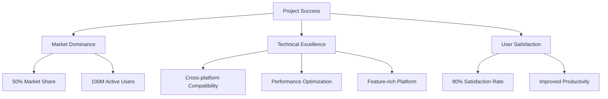
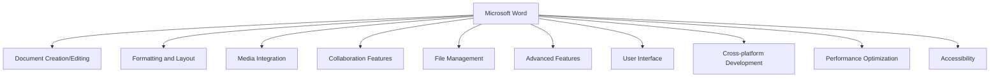
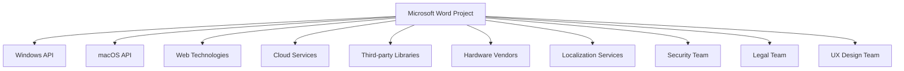
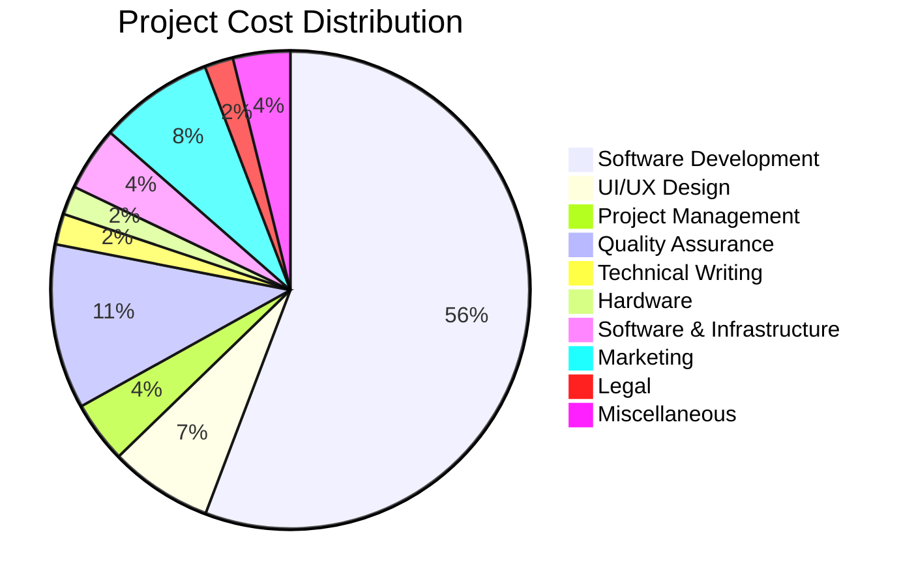
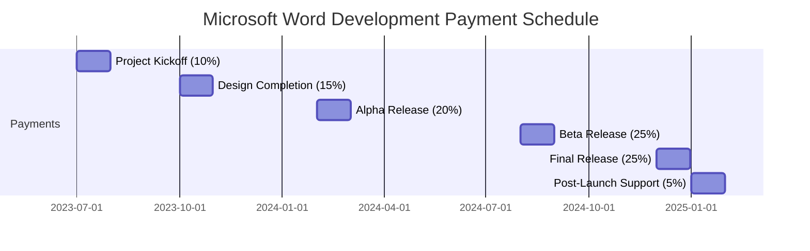
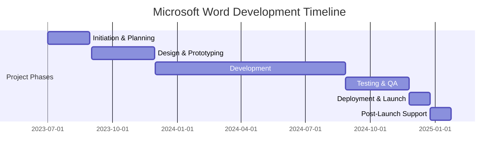
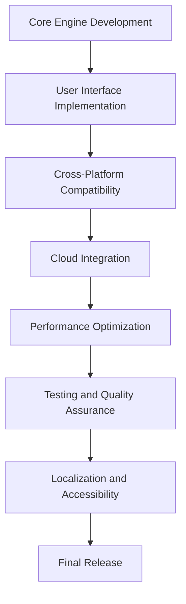
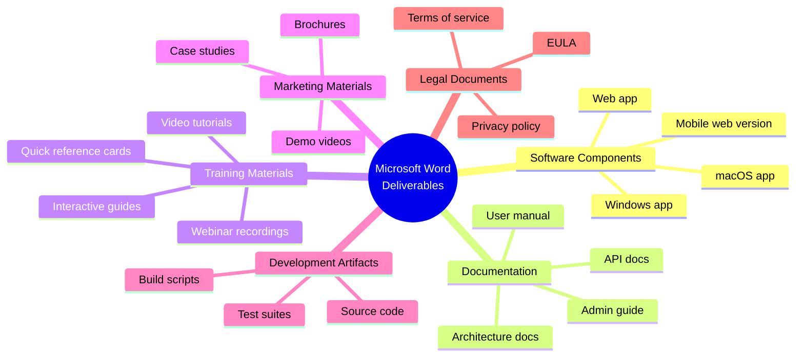
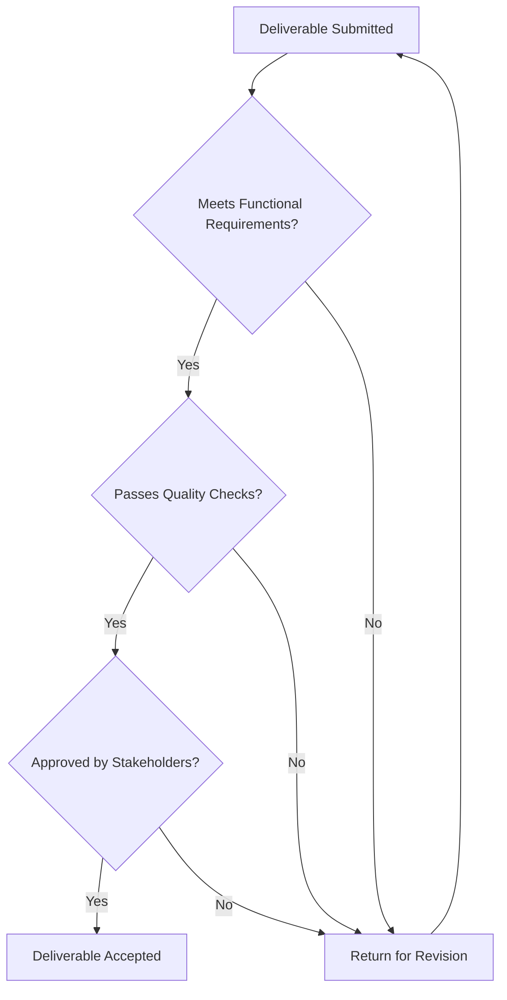

# EXECUTIVE SUMMARY

## PROJECT OVERVIEW

Microsoft Word is a groundbreaking word processing software designed to revolutionize document creation, editing, and formatting. This comprehensive solution addresses the growing need for a versatile, user-friendly tool that streamlines text-based workflows across various industries and personal use cases. By offering a rich set of features, Microsoft Word aims to become the go-to application for all document-related tasks, from simple letter writing to complex report generation.

## OBJECTIVES

1. Develop a robust word processing application with intuitive document creation and editing capabilities
2. Implement advanced formatting tools for professional-grade document styling and layout
3. Integrate multimedia support for tables, images, and other media elements
4. Create collaboration features to enhance team productivity and document version control
5. Ensure cross-platform compatibility (Windows, macOS, and web-based versions)
6. Provide seamless cloud integration for file sharing and access across devices
7. Offer compatibility with various file formats to facilitate easy document exchange
8. Implement advanced functionalities such as mail merge, macros, and template creation

## VALUE PROPOSITION

Microsoft Word offers unparalleled value through its comprehensive approach to word processing:

1. All-in-one solution: Eliminates the need for multiple software tools by providing a single application for all document-related tasks
2. Intuitive user experience: Ribbon toolbar and user-friendly interface ensure quick adoption and increased productivity
3. Versatility: Supports a wide range of document types and use cases, from simple notes to complex reports
4. Collaboration focus: Built-in features for team collaboration and version control enhance workflow efficiency
5. Cross-platform availability: Ensures seamless work continuity across different devices and operating systems
6. Future-proof design: Regular updates and new feature additions keep the software relevant and competitive in the evolving digital landscape

# PROJECT OBJECTIVES

## BUSINESS GOALS

1. Establish Microsoft Word as the industry-leading word processing software
2. Capture a significant market share in the office productivity software segment
3. Generate substantial revenue through software licenses and subscriptions
4. Enhance Microsoft's reputation as an innovator in productivity tools
5. Create a loyal user base across various industries and personal use cases
6. Increase overall productivity for businesses and individuals using the software

## TECHNICAL GOALS

1. Develop a robust and scalable word processing engine
2. Implement an intuitive and customizable user interface
3. Create a comprehensive set of document creation and editing tools
4. Integrate advanced formatting and layout capabilities
5. Develop efficient file management and version control systems
6. Implement seamless cloud integration for file storage and sharing
7. Ensure cross-platform compatibility (Windows, macOS, and web-based versions)
8. Optimize performance for handling large documents and complex formatting
9. Implement collaboration features for real-time editing and commenting
10. Develop a flexible architecture to support future feature additions and integrations

## SUCCESS CRITERIA

| Criterion | Target | Measurement Method |
|-----------|--------|---------------------|
| Market Share | 50% of word processing software market within 3 years | Industry reports and sales data |
| User Adoption | 100 million active users within 2 years | User registration and usage analytics |
| Customer Satisfaction | 90% user satisfaction rate | User surveys and feedback analysis |
| Performance | Document load time < 2 seconds for files up to 100 pages | Automated performance testing |
| Cross-platform Compatibility | 99% feature parity across all supported platforms | Feature comparison and user testing |
| File Format Compatibility | Successfully open and edit 95% of common document formats | File compatibility testing |
| Collaboration Efficiency | 30% reduction in document completion time for team projects | User studies and time tracking |
| Revenue Generation | $1 billion in annual revenue within 5 years | Financial reports |

These success criteria will be regularly monitored and evaluated throughout the project lifecycle to ensure Microsoft Word meets its objectives and delivers value to both the business and its users.

# SCOPE OF WORK

## IN-SCOPE

The Microsoft Word project will encompass the following key features and functionalities:

1. Document Creation and Editing
   - Rich text editing capabilities
   - Spell check and grammar correction
   - Auto-save and version history

2. Formatting and Layout
   - Text styling (font, size, color, etc.)
   - Paragraph formatting (alignment, spacing, indentation)
   - Page layout tools (margins, columns, page breaks)
   - Styles and themes for consistent formatting

3. Media Integration
   - Insert and edit tables
   - Image insertion and basic editing
   - Support for charts and graphs
   - Integration of other media types (audio, video)

4. Collaboration Features
   - Track changes
   - Comments and annotations
   - Real-time co-authoring

5. File Management and Compatibility
   - Save and open various file formats (.docx, .doc, .rtf, .txt, .pdf)
   - Integration with cloud storage (OneDrive)
   - File conversion and export options

6. Advanced Features
   - Mail merge functionality
   - Macro recording and execution
   - Template creation and management

7. User Interface
   - Ribbon toolbar for easy feature access
   - Customizable quick access toolbar
   - Dark and light mode options

8. Cross-platform Development
   - Windows desktop application
   - macOS desktop application
   - Web-based version

9. Performance Optimization
   - Efficient handling of large documents
   - Quick load and save times

10. Accessibility Features
    - Screen reader support
    - High contrast modes
    - Keyboard navigation

## OUT-OF-SCOPE

The following items are explicitly excluded from the project scope:

1. Desktop publishing features (complex layout design for magazines or books)
2. Advanced image editing capabilities (beyond basic cropping and resizing)
3. Video or audio editing tools
4. Built-in translation services
5. Integration with third-party productivity tools or plugins
6. Development of mobile applications (iOS, Android)
7. Creation of a full-fledged content management system
8. Implementation of AI-powered writing assistance or content generation
9. Development of a proprietary cloud storage solution
10. Creation of a built-in citation management system

## ASSUMPTIONS

The project plan is based on the following assumptions:

1. Microsoft's existing development infrastructure and tools will be available for use.
2. The necessary hardware resources for development and testing will be provided.
3. The project team will have access to required third-party libraries and APIs.
4. User testing groups will be available for feedback during the development process.
5. Cloud services (Azure) will be available for hosting the web-based version.
6. Legal clearance for all included fonts and stock images will be obtained.
7. The project will have priority access to Microsoft's QA and security testing resources.
8. Existing Microsoft Office codebase can be leveraged for some common functionalities.
9. The marketing team will handle promotion and user adoption strategies.
10. Regular stakeholder meetings will be conducted for project updates and decision-making.

## DEPENDENCIES

The project has the following key dependencies:

| Dependency | Description | Potential Impact |
|------------|-------------|-------------------|
| Windows API | For deep integration with the Windows OS | Delays in Windows API updates could affect feature implementation |
| macOS API | For native macOS application development | Changes in macOS requirements may impact development timeline |
| Web Technologies | HTML5, CSS3, and JavaScript for web version | Evolving web standards may require ongoing adjustments |
| Cloud Services | Microsoft Azure for web hosting and cloud storage | Service disruptions could affect online features |
| Third-party Libraries | For specific functionalities (e.g., PDF handling) | Library updates or deprecations may require code changes |
| Hardware Vendors | For testing on various devices and configurations | Delayed access to new hardware could impact compatibility testing |
| Localization Services | For multi-language support | Delays in translation could affect international release |
| Security Team | For regular security audits and penetration testing | Discovered vulnerabilities may require additional development time |
| Legal Team | For compliance checks and licensing agreements | Legal issues could delay feature implementation or release |
| UX Design Team | For interface design and usability testing | Design changes may impact development timelines |

These dependencies will be closely monitored throughout the project lifecycle to mitigate risks and ensure timely delivery of the Microsoft Word application across all planned platforms.

# BUDGET AND COST ESTIMATES

## COST BREAKDOWN

The following table provides a detailed breakdown of the estimated costs for the Microsoft Word project:

| Category | Item | Cost (USD) |
|----------|------|------------|
| Labor | Software Development (20 developers x 18 months) | $7,200,000 |
| Labor | UI/UX Design (5 designers x 12 months) | $900,000 |
| Labor | Project Management (2 managers x 18 months) | $540,000 |
| Labor | Quality Assurance (10 testers x 12 months) | $1,440,000 |
| Labor | Technical Writing (3 writers x 6 months) | $270,000 |
| Hardware | Development Workstations (30 units) | $150,000 |
| Hardware | Testing Devices (various platforms) | $100,000 |
| Software | Development Tools and Licenses | $200,000 |
| Infrastructure | Cloud Services (Azure) for 18 months | $360,000 |
| Marketing | Initial Marketing Campaign | $1,000,000 |
| Legal | Licensing and Compliance | $250,000 |
| Miscellaneous | Travel, Training, and Contingency | $500,000 |
| **Total** | | **$12,910,000** |

## PAYMENT SCHEDULE

The proposed payment schedule is tied to key project milestones and deliverables:

| Milestone | Deliverable | Payment (% of Total) | Estimated Date |
|-----------|-------------|----------------------|----------------|
| Project Kickoff | Approved Project Plan | 10% | Month 1 |
| Design Completion | UI/UX Designs and Prototypes | 15% | Month 4 |
| Alpha Release | Core Functionality Implementation | 20% | Month 8 |
| Beta Release | Feature-Complete Software | 25% | Month 14 |
| Final Release | Fully Tested and Optimized Product | 25% | Month 18 |
| Post-Launch Support | 30-Day Post-Launch Support and Fixes | 5% | Month 19 |

## BUDGET CONSIDERATIONS

Several factors could potentially impact the budget and require careful management:

1. Scope Creep: As the project progresses, there may be requests for additional features or functionality. A strict change management process will be implemented to evaluate and approve any scope changes, assessing their impact on the budget.

2. Technology Changes: Rapid advancements in web technologies or operating system updates may require additional development time or resources. We have allocated a portion of the budget for contingencies to address such changes.

3. Third-Party Integration Costs: If unforeseen integrations with third-party services become necessary, additional licensing or development costs may be incurred. We will carefully evaluate each integration for its cost-benefit ratio.

4. Extended Testing Phase: If significant bugs or performance issues are discovered during testing, additional time and resources may be required. Our QA budget includes some buffer for extended testing scenarios.

5. Cloud Infrastructure Scaling: As the web-based version of Microsoft Word gains popularity, cloud infrastructure costs may increase. We will closely monitor usage and adjust our cloud services budget accordingly.

6. Currency Fluctuations: For international team members or services, currency exchange rate fluctuations could impact costs. We will use financial instruments to hedge against significant currency risks.

7. Talent Acquisition and Retention: The competitive tech job market may require adjustments to our labor budget to attract and retain top talent. We have some flexibility built into our labor costs to account for this.

8. Cybersecurity Measures: Evolving security threats may necessitate additional investments in security infrastructure and testing. A portion of our miscellaneous budget is reserved for potential security enhancements.

9. Accessibility Compliance: Ensuring full accessibility across all platforms may require more resources than initially estimated. We will prioritize accessibility features and allocate resources as needed from our contingency fund.

10. Marketing Strategy Adjustments: Depending on initial user adoption rates, we may need to adjust our marketing strategy and potentially increase the marketing budget. We will closely monitor early adoption metrics and adjust accordingly.

To manage these considerations, we will:
- Conduct monthly budget reviews
- Maintain a detailed risk register with potential budget impacts
- Implement a change control process for any modifications to project scope or timeline
- Hold quarterly stakeholder meetings to discuss budget status and any necessary adjustments

By proactively addressing these budget considerations, we aim to deliver the Microsoft Word project within the estimated budget while maintaining the flexibility to adapt to changing circumstances.

# TIMELINE AND MILESTONES

## PROJECT TIMELINE

The Microsoft Word project is estimated to span 18 months, divided into the following major phases:

1. Initiation & Planning: 2 months (July 2023 - August 2023)
2. Design & Prototyping: 3 months (September 2023 - November 2023)
3. Development: 9 months (December 2023 - August 2024)
4. Testing & QA: 3 months (September 2024 - November 2024)
5. Deployment & Launch: 1 month (December 2024)
6. Post-Launch Support: 1 month (January 2025)

## KEY MILESTONES

| Milestone | Description | Target Date |
|-----------|-------------|-------------|
| Project Kickoff | Completion of project planning and team onboarding | August 1, 2023 |
| Design Approval | Finalization of UI/UX designs and prototypes | November 30, 2023 |
| Alpha Release | Core functionality implementation for internal testing | April 30, 2024 |
| Feature Freeze | Completion of all planned features | August 31, 2024 |
| Beta Release | Feature-complete software for external testing | October 15, 2024 |
| Performance Optimization | Completion of performance tuning and optimization | November 30, 2024 |
| Final Release | Fully tested and optimized product ready for launch | December 20, 2024 |
| Post-Launch Review | Evaluation of initial user feedback and performance metrics | January 25, 2025 |

## CRITICAL PATH

The following tasks and activities are critical to keeping the Microsoft Word project on schedule:

1. Core Engine Development
   - Text rendering and manipulation
   - Document structure management
   - File format compatibility

2. User Interface Implementation
   - Ribbon toolbar development
   - Document view and editing area
   - Dialog and pane systems

3. Cross-Platform Compatibility
   - Windows version development
   - macOS version development
   - Web-based version development

4. Cloud Integration
   - OneDrive synchronization
   - Real-time collaboration features

5. Performance Optimization
   - Large document handling
   - Memory management
   - Rendering speed improvements

6. Testing and Quality Assurance
   - Functionality testing across all platforms
   - Performance benchmarking
   - Security audits

7. Localization and Accessibility
   - Multi-language support implementation
   - Accessibility features development and testing

Ensuring timely completion of these critical path items will be essential for meeting the project's deadlines and delivering a high-quality Microsoft Word application across all planned platforms.

# DELIVERABLES

## LIST OF DELIVERABLES

The Microsoft Word project will produce the following tangible outputs:

1. Software Components
   - Windows desktop application
   - macOS desktop application
   - Web-based application
   - Mobile-responsive web version

2. Documentation
   - User manual
   - Administrator guide
   - API documentation for extensibility
   - System architecture documentation

3. Training Materials
   - Video tutorials
   - Interactive user guides
   - Quick reference cards
   - Webinar recordings

4. Marketing Materials
   - Product brochures
   - Demo videos
   - Case studies

5. Development Artifacts
   - Source code repository
   - Build and deployment scripts
   - Test suites and test results

6. Legal Documents
   - End-user license agreement (EULA)
   - Privacy policy
   - Terms of service

## DELIVERY SCHEDULE

The following table outlines the expected delivery dates for each major deliverable:

| Deliverable | Expected Delivery Date |
|-------------|------------------------|
| Initial UI/UX Designs | October 15, 2023 |
| Alpha Version (Windows) | April 30, 2024 |
| Alpha Version (macOS) | May 15, 2024 |
| Alpha Version (Web) | May 31, 2024 |
| Beta Version (All Platforms) | October 15, 2024 |
| Final Software Release | December 20, 2024 |
| User Documentation | December 1, 2024 |
| Administrator Guide | December 5, 2024 |
| API Documentation | December 10, 2024 |
| Training Materials | December 15, 2024 |
| Marketing Materials | November 30, 2024 |
| Legal Documents | December 1, 2024 |

## ACCEPTANCE CRITERIA

The following criteria will be used to determine the acceptance of key deliverables:

1. Software Components
   - All specified features are implemented and functional
   - Performance benchmarks are met (e.g., load times, file handling capacity)
   - Cross-platform compatibility is achieved with 99% feature parity
   - Passes all security audits and penetration tests
   - Achieves a 90% user satisfaction rate in beta testing

2. Documentation
   - Covers all features and functionalities comprehensively
   - Follows Microsoft documentation standards
   - Passes editorial review for clarity and accuracy
   - Available in all supported languages

3. Training Materials
   - Covers all major features and common use cases
   - Accessible to users with different learning styles
   - Receives positive feedback from a test group of users
   - Compatible with major learning management systems

4. Marketing Materials
   - Accurately represents product features and benefits
   - Aligns with Microsoft branding guidelines
   - Approved by legal team for compliance with advertising standards
   - Demonstrates effectiveness in focus group testing

5. Development Artifacts
   - Source code passes code review and adheres to coding standards
   - Build scripts successfully deploy to all target platforms
   - Test suites achieve minimum 90% code coverage
   - All critical and high-priority bugs are resolved

6. Legal Documents
   - Approved by legal department
   - Complies with relevant laws and regulations in target markets
   - Written in clear, understandable language for end-users

Each deliverable will be subject to a formal review process. Only when all applicable acceptance criteria are met will the deliverable be considered complete and accepted by the project stakeholders.