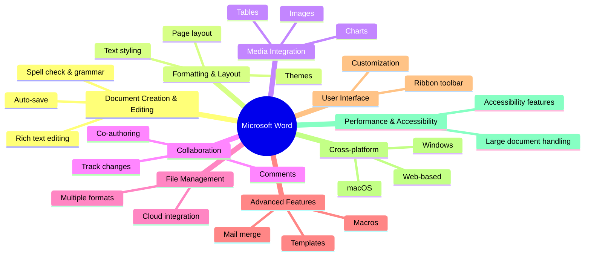
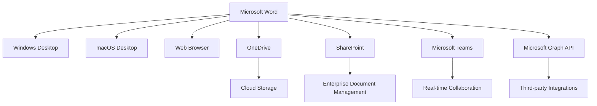
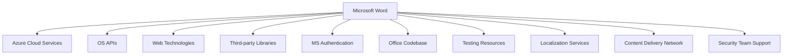
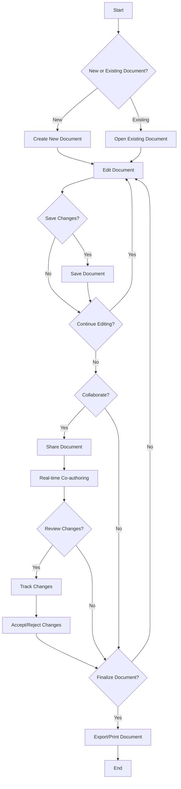
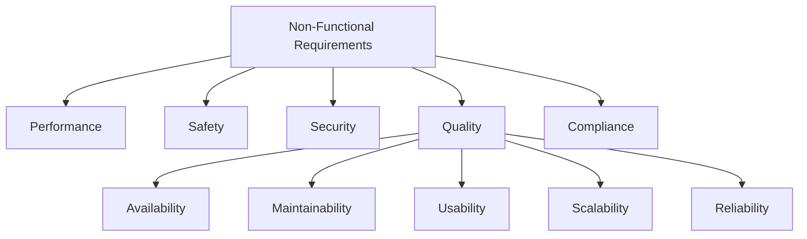
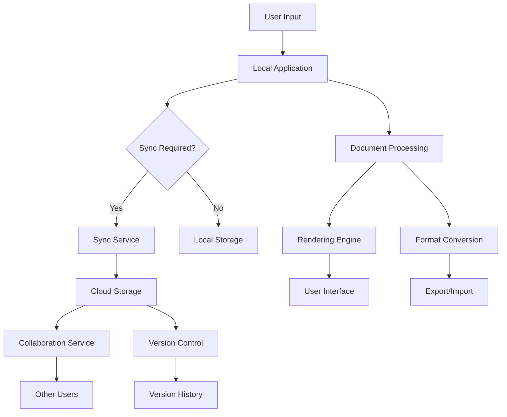
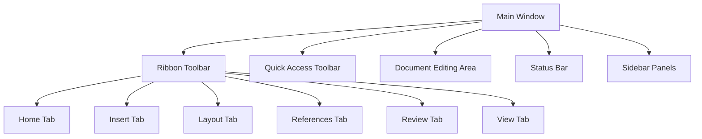
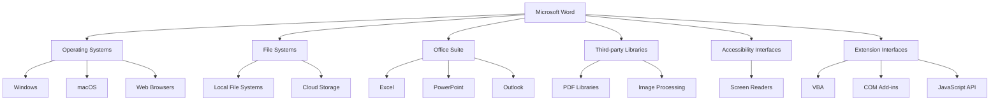

# INTRODUCTION

## PURPOSE

The purpose of this Software Requirements Specification (SRS) document is to provide a comprehensive and detailed description of the Microsoft Word software application. This document serves as the primary reference for the development team, project stakeholders, and quality assurance personnel throughout the software development lifecycle. It aims to:

1. Clearly define the functional and non-functional requirements of Microsoft Word
2. Establish a shared understanding of the project scope and objectives among all stakeholders
3. Serve as a basis for project planning, cost estimation, and resource allocation
4. Provide a benchmark for validating the final product against the initial requirements

The intended audience for this SRS includes:

- Software developers and engineers
- Project managers and team leads
- Quality assurance and testing teams
- User experience (UX) designers
- Technical writers and documentation specialists
- Senior management and key decision-makers
- Potential integration partners and third-party developers

## SCOPE

Microsoft Word is a comprehensive word processing software designed to revolutionize document creation, editing, and formatting across multiple platforms. The scope of this project encompasses the development of a feature-rich application that caters to a wide range of users, from individuals to large enterprises.

### Goals

1. Create a user-friendly and intuitive word processing application
2. Provide advanced document creation and editing capabilities
3. Offer robust formatting and layout tools for professional-grade documents
4. Enable seamless collaboration and file sharing across devices and platforms
5. Ensure cross-platform compatibility (Windows, macOS, and web-based versions)
6. Integrate cloud storage for enhanced accessibility and data security

### Benefits

1. Increased productivity through streamlined document workflows
2. Enhanced document quality and consistency with advanced formatting tools
3. Improved collaboration and communication within teams
4. Reduced learning curve due to intuitive interface design
5. Flexibility to work across different devices and operating systems
6. Cost-effective solution for a wide range of document processing needs

### Core Functionalities

1. Document Creation and Editing
   - Rich text editing with spell check and grammar correction
   - Auto-save and version history

2. Formatting and Layout
   - Text styling and paragraph formatting
   - Page layout tools and styles/themes for consistent formatting

3. Media Integration
   - Tables, images, charts, and other media insertion and editing

4. Collaboration Features
   - Track changes, comments, and real-time co-authoring

5. File Management and Compatibility
   - Support for various file formats (.docx, .doc, .rtf, .txt, .pdf)
   - Integration with cloud storage (OneDrive)

6. Advanced Features
   - Mail merge, macro recording/execution, and template management

7. User Interface
   - Ribbon toolbar and customizable quick access toolbar
   - Dark and light mode options

8. Cross-platform Development
   - Windows and macOS desktop applications
   - Web-based version with mobile responsiveness

9. Performance and Accessibility
   - Efficient handling of large documents
   - Screen reader support and keyboard navigation



This SRS document will detail the requirements for each of these core functionalities, ensuring that Microsoft Word becomes the premier word processing solution in the market, meeting the diverse needs of its users across various platforms and use cases.

# PRODUCT DESCRIPTION

## PRODUCT PERSPECTIVE

Microsoft Word is a standalone word processing application that is part of the larger Microsoft Office suite of productivity software. It is designed to operate on multiple platforms, including Windows, macOS, and web browsers, providing a consistent user experience across devices. The software integrates seamlessly with other Microsoft products and services, particularly:

1. OneDrive: For cloud storage and file synchronization
2. SharePoint: For enterprise-level document management and collaboration
3. Microsoft Teams: For real-time co-authoring and communication
4. Microsoft Graph API: For extensibility and integration with third-party applications

While Microsoft Word can function independently, its full potential is realized when used in conjunction with these complementary services, creating a comprehensive ecosystem for document creation, editing, and collaboration.



## PRODUCT FUNCTIONS

Microsoft Word provides a comprehensive set of functions for document processing:

1. Document Creation and Editing
   - Rich text editing with advanced formatting options
   - Spell check and grammar correction
   - Auto-save and version history

2. Page Layout and Design
   - Page setup with margins, orientation, and size options
   - Multi-column layouts
   - Header and footer customization

3. Styles and Formatting
   - Predefined and custom styles for consistent formatting
   - Theme application for document-wide visual coherence

4. Media Integration
   - Table creation and formatting
   - Image insertion and basic editing
   - Chart and graph integration

5. Collaboration Tools
   - Real-time co-authoring
   - Track changes and version comparison
   - Comments and annotations

6. File Management
   - Support for multiple file formats (.docx, .doc, .rtf, .txt, .pdf)
   - Document encryption and password protection
   - Cloud storage integration with OneDrive

7. Advanced Features
   - Mail merge for mass communication
   - Macro recording and execution for task automation
   - Template creation and management

8. Accessibility
   - Screen reader support
   - Accessibility checker for creating inclusive documents

9. Cross-platform Functionality
   - Consistent feature set across Windows, macOS, and web versions
   - Responsive design for various screen sizes

## USER CHARACTERISTICS

Microsoft Word caters to a diverse user base with varying levels of expertise:

1. Novice Users
   - Characteristics: Limited computer skills, occasional document creation
   - Needs: Intuitive interface, basic formatting tools, templates
   - Persona: Sarah, a small business owner who needs to create simple flyers and letters

2. Intermediate Users
   - Characteristics: Regular computer users, frequent document creation
   - Needs: Advanced formatting options, collaboration tools, file management
   - Persona: Mark, a marketing professional who creates reports and presentations

3. Advanced Users
   - Characteristics: Proficient in word processing, power users
   - Needs: Advanced features like macros, custom styles, and complex layouts
   - Persona: Emily, a technical writer who creates large, structured documents

4. Professional Users
   - Characteristics: Expert-level users, often in specialized fields
   - Needs: Integration with other tools, advanced collaboration, and customization
   - Persona: David, a lawyer who needs to create and manage complex legal documents

5. Accessibility Users
   - Characteristics: Users with visual, auditory, or motor impairments
   - Needs: Screen reader compatibility, keyboard navigation, high contrast modes
   - Persona: Lisa, a visually impaired student who uses assistive technologies

## CONSTRAINTS

1. Technical Constraints
   - Must maintain backwards compatibility with older file formats
   - Web version limited by browser capabilities and security restrictions
   - Performance optimization required for large documents and complex formatting

2. Regulatory Constraints
   - Compliance with data protection regulations (e.g., GDPR, CCPA)
   - Accessibility standards compliance (e.g., WCAG 2.1)
   - Export control regulations for encryption features

3. Business Constraints
   - Integration with existing Microsoft services and APIs
   - Adherence to Microsoft's pricing and licensing models
   - Compatibility with Microsoft's update and support cycles

4. User Interface Constraints
   - Consistency with Microsoft Office design language
   - Support for multiple languages and right-to-left scripts
   - Adaptability to various screen sizes and input methods

5. Security Constraints
   - Implementation of robust document encryption
   - Secure cloud storage and transmission of files
   - Protection against macro-based security threats

## ASSUMPTIONS AND DEPENDENCIES

Assumptions:
1. Users have basic computer literacy and familiarity with word processing concepts
2. Internet connectivity is available for cloud-based features and updates
3. Users have access to compatible hardware (e.g., computers, tablets) for running the software
4. The majority of users will prefer cloud storage over local storage for documents

Dependencies:
1. Microsoft Azure cloud services for hosting the web version and providing cloud storage
2. Operating system APIs for deep integration with Windows and macOS
3. Web browser technologies (HTML5, CSS3, JavaScript) for the web-based version
4. Third-party libraries for specific functionalities (e.g., PDF handling, advanced image processing)
5. Microsoft's authentication services for user account management and security
6. Continuous updates to the Microsoft Office codebase for shared components
7. Availability of testing resources across various hardware configurations and operating systems
8. Localization services for multi-language support
9. Microsoft's global content delivery network for software distribution and updates
10. Ongoing support from Microsoft's security team for threat analysis and mitigation



These assumptions and dependencies are critical for the successful development, deployment, and operation of Microsoft Word across all intended platforms and use cases.

# PROCESS FLOWCHART

The following process flowchart illustrates the high-level workflow for creating, editing, and collaborating on a document using Microsoft Word:



This flowchart demonstrates the core processes involved in using Microsoft Word, including:

1. Document Creation/Opening: Users can either create a new document or open an existing one.
2. Editing: The main process where users input and format content.
3. Saving: Regular saving of changes to prevent data loss.
4. Collaboration: Sharing and co-authoring features for team projects.
5. Review: Tracking changes and accepting/rejecting edits from collaborators.
6. Finalization: Exporting or printing the completed document.

The flowchart also shows decision points where users can choose different paths based on their needs, such as continuing to edit, collaborating with others, or finalizing the document.

This process aligns with the previously mentioned features and functionalities of Microsoft Word, including document creation and editing, collaboration tools, and file management capabilities across Windows, macOS, and web-based platforms.

Here's a breakdown of Microsoft Word features with the requested sub-sections:

1. Document Creation and Editing

ID: F001
DESCRIPTION: Core functionality for creating and editing text documents.
PRIORITY: High

| Requirement ID | Requirement Description |
|----------------|--------------------------|
| F001-1 | Create new blank documents |
| F001-2 | Open existing documents in supported formats |
| F001-3 | Provide rich text editing capabilities |
| F001-4 | Implement spell check and grammar correction |
| F001-5 | Auto-save documents at regular intervals |
| F001-6 | Maintain version history for documents |

2. Formatting and Layout

ID: F002
DESCRIPTION: Tools for text and document formatting and layout design.
PRIORITY: High

| Requirement ID | Requirement Description |
|----------------|--------------------------|
| F002-1 | Implement text styling options (font, size, color, etc.) |
| F002-2 | Provide paragraph formatting tools (alignment, spacing, indentation) |
| F002-3 | Include page layout features (margins, columns, page breaks) |
| F002-4 | Offer pre-defined and custom styles for consistent formatting |
| F002-5 | Implement themes for document-wide visual coherence |

3. Media Integration

ID: F003
DESCRIPTION: Capabilities to insert and manipulate various media types within documents.
PRIORITY: Medium

| Requirement ID | Requirement Description |
|----------------|--------------------------|
| F003-1 | Allow insertion and formatting of tables |
| F003-2 | Enable image insertion with basic editing capabilities |
| F003-3 | Support integration of charts and graphs |
| F003-4 | Provide options to insert and display other media types (audio, video) |

4. Collaboration Features

ID: F004
DESCRIPTION: Tools to facilitate team collaboration on documents.
PRIORITY: High

| Requirement ID | Requirement Description |
|----------------|--------------------------|
| F004-1 | Implement track changes functionality |
| F004-2 | Provide commenting and annotation tools |
| F004-3 | Enable real-time co-authoring for multiple users |
| F004-4 | Include document sharing capabilities |

5. File Management and Compatibility

ID: F005
DESCRIPTION: Features for managing files and ensuring compatibility with various formats.
PRIORITY: High

| Requirement ID | Requirement Description |
|----------------|--------------------------|
| F005-1 | Support saving and opening multiple file formats (.docx, .doc, .rtf, .txt, .pdf) |
| F005-2 | Integrate with OneDrive for cloud storage |
| F005-3 | Implement file conversion and export options |
| F005-4 | Provide document encryption and password protection |

6. Advanced Features

ID: F006
DESCRIPTION: Specialized tools for advanced document processing tasks.
PRIORITY: Medium

| Requirement ID | Requirement Description |
|----------------|--------------------------|
| F006-1 | Implement mail merge functionality |
| F006-2 | Provide macro recording and execution capabilities |
| F006-3 | Enable template creation and management |
| F006-4 | Include advanced search and replace functions |

7. User Interface

ID: F007
DESCRIPTION: Design and implementation of the graphical user interface.
PRIORITY: High

| Requirement ID | Requirement Description |
|----------------|--------------------------|
| F007-1 | Develop a ribbon toolbar for easy feature access |
| F007-2 | Implement a customizable quick access toolbar |
| F007-3 | Provide dark and light mode options |
| F007-4 | Ensure responsive design for various screen sizes |

8. Cross-platform Development

ID: F008
DESCRIPTION: Ensuring consistent functionality across different operating systems and platforms.
PRIORITY: High

| Requirement ID | Requirement Description |
|----------------|--------------------------|
| F008-1 | Develop a fully functional Windows desktop application |
| F008-2 | Create a feature-equivalent macOS desktop application |
| F008-3 | Implement a web-based version with core functionalities |
| F008-4 | Ensure consistent user experience across all platforms |

9. Performance Optimization

ID: F009
DESCRIPTION: Enhancements to ensure efficient operation of the software.
PRIORITY: Medium

| Requirement ID | Requirement Description |
|----------------|--------------------------|
| F009-1 | Optimize for efficient handling of large documents |
| F009-2 | Implement quick load and save times |
| F009-3 | Optimize memory usage for resource-intensive operations |
| F009-4 | Ensure smooth scrolling and navigation in large documents |

10. Accessibility Features

ID: F010
DESCRIPTION: Tools and enhancements to make the software accessible to users with disabilities.
PRIORITY: Medium

| Requirement ID | Requirement Description |
|----------------|--------------------------|
| F010-1 | Implement screen reader support |
| F010-2 | Provide high contrast modes |
| F010-3 | Enable full keyboard navigation |
| F010-4 | Include an accessibility checker for created documents |

This feature breakdown maintains consistency with the previously mentioned technology choices, including the use of Windows and macOS APIs for desktop applications, web technologies for the browser-based version, and integration with Microsoft services like OneDrive for cloud storage.

# NON-FUNCTIONAL REQUIREMENTS

## PERFORMANCE

| ID | Requirement | Description | Metric |
|----|-------------|-------------|--------|
| NFR-P1 | Document Load Time | The application shall load documents quickly | < 2 seconds for documents up to 100 pages |
| NFR-P2 | Typing Responsiveness | The application shall provide real-time response to user input | < 50ms lag between keypress and display |
| NFR-P3 | Scrolling Performance | The application shall maintain smooth scrolling in large documents | 60 fps scrolling for documents up to 1000 pages |
| NFR-P4 | Save Operation | The application shall save documents efficiently | < 5 seconds for documents up to 100MB |
| NFR-P5 | Memory Usage | The application shall optimize memory consumption | < 1GB RAM usage for documents up to 1000 pages |
| NFR-P6 | CPU Utilization | The application shall efficiently use CPU resources | < 25% CPU usage during normal operations |
| NFR-P7 | Startup Time | The application shall start quickly | < 5 seconds on standard hardware configurations |

## SAFETY

| ID | Requirement | Description |
|----|-------------|-------------|
| NFR-S1 | Auto-save | The application shall automatically save user work at regular intervals to prevent data loss |
| NFR-S2 | Crash Recovery | The application shall provide document recovery options in case of unexpected shutdowns |
| NFR-S3 | Data Backup | The application shall support automatic cloud backup when connected to the internet |
| NFR-S4 | Version History | The application shall maintain a version history of documents for easy recovery of previous states |
| NFR-S5 | Safe Mode | The application shall provide a safe mode operation with limited features in case of critical errors |

## SECURITY

| ID | Requirement | Description |
|----|-------------|-------------|
| NFR-SE1 | Authentication | The application shall use Microsoft Account for user authentication |
| NFR-SE2 | Authorization | The application shall implement role-based access control for shared documents |
| NFR-SE3 | Data Encryption | The application shall encrypt documents at rest using AES-256 encryption |
| NFR-SE4 | Secure Communication | The application shall use TLS 1.3 for all network communications |
| NFR-SE5 | Privacy Controls | The application shall provide user-configurable privacy settings |
| NFR-SE6 | Audit Logging | The application shall maintain logs of all security-relevant events |
| NFR-SE7 | Macro Security | The application shall provide configurable security levels for macro execution |

## QUALITY

### Availability

| ID | Requirement | Description | Metric |
|----|-------------|-------------|--------|
| NFR-QA1 | Uptime | The web-based version shall maintain high availability | 99.9% uptime |
| NFR-QA2 | Offline Functionality | The desktop versions shall provide core functionality without internet connection | 100% of core features available offline |

### Maintainability

| ID | Requirement | Description |
|----|-------------|-------------|
| NFR-QM1 | Modular Architecture | The application shall be built using a modular architecture to facilitate updates and maintenance |
| NFR-QM2 | Automated Testing | The application shall have comprehensive automated test coverage |
| NFR-QM3 | Logging | The application shall implement detailed logging for troubleshooting and debugging |

### Usability

| ID | Requirement | Description | Metric |
|----|-------------|-------------|--------|
| NFR-QU1 | Intuitive Interface | The application shall provide an intuitive user interface | 90% of users able to perform basic tasks without assistance |
| NFR-QU2 | Accessibility | The application shall comply with WCAG 2.1 Level AA standards | 100% compliance with WCAG 2.1 Level AA |
| NFR-QU3 | Localization | The application shall support multiple languages | Support for at least 20 languages |

### Scalability

| ID | Requirement | Description |
|----|-------------|-------------|
| NFR-QS1 | Large Document Handling | The application shall efficiently handle large documents | Support for documents up to 10,000 pages |
| NFR-QS2 | Concurrent Users | The web-based version shall support a large number of concurrent users | Up to 1 million concurrent users |

### Reliability

| ID | Requirement | Description | Metric |
|----|-------------|-------------|--------|
| NFR-QR1 | Mean Time Between Failures | The application shall operate for extended periods without failure | MTBF > 720 hours |
| NFR-QR2 | Error Rate | The application shall maintain a low error rate during normal operation | < 0.1% error rate for all operations |

## COMPLIANCE

| ID | Requirement | Description |
|----|-------------|-------------|
| NFR-C1 | GDPR Compliance | The application shall comply with GDPR requirements for data protection and privacy |
| NFR-C2 | CCPA Compliance | The application shall comply with CCPA requirements for California users |
| NFR-C3 | ISO 27001 | The development and operation processes shall comply with ISO 27001 standards for information security management |
| NFR-C4 | Section 508 | The application shall comply with Section 508 standards for accessibility |
| NFR-C5 | HIPAA Compliance | The application shall provide features to support HIPAA compliance for healthcare-related documents |
| NFR-C6 | Export Regulations | The application shall comply with relevant export control regulations for encryption technologies |



These non-functional requirements align with the previously mentioned technology choices, including the use of Microsoft Account for authentication, cloud integration for backup and synchronization, and cross-platform development for Windows, macOS, and web-based versions. The requirements also consider the performance needs of a robust word processing application, the security considerations for handling sensitive documents, and the quality attributes necessary for a professional-grade software product.

# DATA REQUIREMENTS

## DATA MODELS

Microsoft Word handles various types of data structures to support its rich feature set. The following entity-relationship diagram illustrates the core data models used in the application:

```mermaid
erDiagram
    DOCUMENT ||--o{ PARAGRAPH : contains
    DOCUMENT ||--o{ STYLE : uses
    DOCUMENT ||--o{ COMMENT : has
    DOCUMENT ||--o{ VERSION : has
    PARAGRAPH ||--o{ RUN : contains
    RUN ||--o{ FORMATTING : has
    STYLE ||--o{ FORMATTING : defines
    USER ||--o{ DOCUMENT : creates
    USER ||--o{ COMMENT : makes
    USER ||--o{ VERSION : creates

    DOCUMENT {
        string id
        string title
        datetime created_at
        datetime modified_at
        string creator_id
    }
    PARAGRAPH {
        string id
        int order
        string style_id
    }
    RUN {
        string id
        string text
        string formatting_id
    }
    STYLE {
        string id
        string name
        string type
    }
    FORMATTING {
        string id
        string font_family
        int font_size
        string font_color
        boolean bold
        boolean italic
        boolean underline
    }
    COMMENT {
        string id
        string content
        datetime created_at
        string user_id
    }
    VERSION {
        string id
        datetime created_at
        string document_id
        string user_id
    }
    USER {
        string id
        string name
        string email
    }
```

This data model supports the core functionality of Microsoft Word, including document structure, formatting, collaboration features, and version control.

## DATA STORAGE

Microsoft Word employs a hybrid approach to data storage, leveraging both local storage and cloud-based solutions to ensure data availability, redundancy, and security.

### Local Storage
- File Format: Documents are primarily stored in the .docx format, which is based on the Office Open XML standard.
- Temporary Files: Auto-save and recovery files are stored locally in a designated temporary directory.
- User Preferences: Application settings and user preferences are stored in local configuration files.

### Cloud Storage
- Primary Storage: OneDrive is used as the primary cloud storage solution for documents.
- Synchronization: Documents are automatically synchronized between local and cloud storage to ensure data consistency across devices.

### Data Retention
- Cloud Storage: Documents stored in OneDrive follow Microsoft's data retention policies, typically retaining data indefinitely unless explicitly deleted by the user.
- Version History: The system maintains up to 500 versions of each document for premium users, with a 30-day retention period for standard users.

### Redundancy and Backup
- Cloud Redundancy: OneDrive implements geo-redundant storage, ensuring multiple copies of data are stored across different geographical locations.
- Local Backups: Users are encouraged to enable Windows Backup or Time Machine (for macOS) to create local backups of their documents.
- Automated Backups: The application performs automated backups to OneDrive at regular intervals (configurable by the user).

### Recovery
- Auto-recovery: The application automatically saves recovery information every 10 minutes (default, configurable).
- Version Restore: Users can restore previous versions of documents from the version history.
- Disaster Recovery: In case of data center failures, Microsoft's cloud infrastructure allows for rapid recovery and failover to ensure continuous data availability.

### Scalability
- Sharding: Document data is sharded across multiple database instances based on user IDs to handle large-scale data storage.
- Caching: Frequently accessed document metadata is cached using Redis to reduce database load and improve performance.
- Content Delivery Network (CDN): Static assets and shared document resources are distributed via Microsoft's global CDN to ensure fast access worldwide.

## DATA PROCESSING

Microsoft Word implements robust data processing mechanisms to handle document creation, editing, and collaboration while ensuring data security and integrity.

### Data Flow

The following diagram illustrates the high-level data flow within the Microsoft Word application:



### Data Security

To ensure the security of user data, Microsoft Word implements the following measures:

1. Encryption:
   - At Rest: All documents stored in OneDrive are encrypted using AES 256-bit encryption.
   - In Transit: All data transmissions use TLS 1.3 protocol to ensure secure communication.

2. Authentication:
   - Multi-factor Authentication (MFA) is supported and encouraged for all user accounts.
   - OAuth 2.0 is used for secure authorization of third-party integrations.

3. Access Control:
   - Role-Based Access Control (RBAC) is implemented for shared documents.
   - Document owners can set granular permissions for viewing, editing, and sharing.

4. Data Integrity:
   - Checksums are used to verify the integrity of documents during synchronization.
   - Conflict resolution mechanisms are in place to handle simultaneous edits.

5. Audit Logging:
   - All access and modifications to documents are logged for auditing purposes.
   - Logs are securely stored and retained according to compliance requirements.

6. Compliance:
   - The application adheres to GDPR, CCPA, and other relevant data protection regulations.
   - Data Processing Agreements (DPAs) are in place with all third-party service providers.

7. Secure Development:
   - The application undergoes regular security audits and penetration testing.
   - Secure coding practices are enforced, including input validation and output encoding.

8. Data Isolation:
   - User data is logically isolated in multi-tenant environments to prevent unauthorized access.

9. Secure Deletion:
   - When documents are deleted, a secure deletion process ensures data cannot be recovered.

10. Privacy Controls:
    - Users have granular control over data sharing and privacy settings.
    - Privacy impact assessments are conducted for new features and integrations.

By implementing these data processing and security measures, Microsoft Word ensures the confidentiality, integrity, and availability of user data while providing a seamless and collaborative document editing experience across platforms.

# EXTERNAL INTERFACES

## USER INTERFACES

Microsoft Word will provide a user-friendly and intuitive interface across all supported platforms (Windows, macOS, and web-based versions). The user interface will be designed to maximize productivity while maintaining ease of use for both novice and advanced users.

Key UI components include:

1. Ribbon Toolbar: A customizable ribbon interface that organizes features into logical groups.
2. Quick Access Toolbar: Customizable toolbar for frequently used commands.
3. Document Editing Area: The main workspace for creating and editing documents.
4. Status Bar: Displays document information and quick access to view settings.
5. Sidebar Panels: Contextual panels for additional functionality (e.g., styles, navigation).
6. Dialog Boxes: For advanced settings and operations.

The interface will support both light and dark modes, as well as high-contrast themes for accessibility.

[Placeholder for UI mockups]



## HARDWARE INTERFACES

As a software application, Microsoft Word primarily interacts with hardware through the operating system. However, it will have specific requirements and optimizations for the following hardware interfaces:

1. Display:
   - Support for various screen resolutions and aspect ratios
   - Optimization for high-DPI displays
   - Multi-monitor support

2. Input Devices:
   - Keyboard input with support for shortcuts and macros
   - Mouse and touchpad interaction
   - Touch screen support for compatible devices
   - Pen/stylus input for digital ink and handwriting recognition

3. Storage:
   - Fast read/write operations for local storage devices (HDD, SSD)
   - Efficient handling of network-attached storage

4. Printers:
   - Support for a wide range of printer drivers
   - Integration with printer-specific features (e.g., duplex printing, paper tray selection)

5. Scanners:
   - Integration with TWAIN and WIA compatible scanners for document import

6. Cameras:
   - Support for webcam integration for inserting photos directly into documents

## SOFTWARE INTERFACES

Microsoft Word will interact with various software systems and components:

1. Operating Systems:
   - Windows: Version 10 and later
   - macOS: Version 10.14 (Mojave) and later
   - Web Browsers: Chrome, Firefox, Safari, Edge (latest versions)

2. File Systems:
   - Support for NTFS, FAT32, exFAT, APFS, and HFS+
   - Integration with cloud storage APIs (OneDrive, SharePoint)

3. Microsoft Office Suite:
   - Seamless integration with Excel, PowerPoint, and Outlook
   - Shared components for spell-checking, grammar, and thesaurus

4. Third-party Integrations:
   - PDF libraries for reading and writing PDF files
   - Image processing libraries for basic image editing
   - Font rendering engines for consistent text display

5. Accessibility Interfaces:
   - Integration with screen readers (e.g., JAWS, NVDA, VoiceOver)
   - Support for operating system accessibility APIs

6. Development and Extension Interfaces:
   - Visual Basic for Applications (VBA) for macros and automation
   - COM Add-ins for extended functionality
   - JavaScript API for web add-ins



## COMMUNICATION INTERFACES

Microsoft Word will utilize various communication interfaces to enable collaboration, synchronization, and integration with external services:

1. Network Protocols:
   - HTTP/HTTPS for web-based communication
   - WebSocket for real-time collaboration features
   - SMB/CIFS for network file sharing

2. API Interfaces:
   - RESTful APIs for integration with Microsoft services (e.g., OneDrive, SharePoint)
   - GraphQL for efficient data querying and manipulation

3. Authentication Protocols:
   - OAuth 2.0 for secure authentication with Microsoft accounts and third-party services
   - SAML for enterprise single sign-on integration

4. Data Formats:
   - JSON for data exchange in web services
   - XML for Office Open XML document format
   - Binary formats for legacy file types

5. Synchronization:
   - Delta sync algorithms for efficient document updates
   - Conflict resolution protocols for simultaneous edits

6. Real-time Collaboration:
   - Operational Transformation (OT) or Conflict-free Replicated Data Type (CRDT) for real-time co-authoring

7. Printing Protocols:
   - IPP (Internet Printing Protocol) for network printing
   - PDF for print-to-file functionality

8. Email Integration:
   - SMTP for sending documents via email
   - IMAP/POP3 for receiving and importing email attachments

9. Version Control:
   - Custom version control protocol for document history and restoration

10. Telemetry and Analytics:
    - Secure data transmission protocols for usage analytics and error reporting

These communication interfaces will ensure that Microsoft Word can effectively interact with various external systems, enabling seamless collaboration, data exchange, and integration with the broader Microsoft ecosystem and third-party services.

# APPENDICES

## GLOSSARY

| Term | Definition |
|------|------------|
| Ribbon | A user interface element in Microsoft Word that organizes features into logical groups, displayed as a set of tabs at the top of the application window |
| Macro | A recorded sequence of commands or keyboard strokes that can be played back to automate repetitive tasks |
| Mail Merge | A feature that allows users to create personalized documents by combining a main document with a data source |
| Style | A predefined combination of formatting characteristics that can be applied to text to ensure consistency throughout a document |
| Template | A pre-formatted document that serves as a starting point for creating new documents with a consistent layout and style |
| Track Changes | A feature that records all edits made to a document, allowing users to review, accept, or reject changes |
| OneDrive | Microsoft's cloud storage service integrated with Microsoft Word for file synchronization and sharing |
| Real-time Co-authoring | A feature that allows multiple users to edit a document simultaneously, with changes visible to all participants in real-time |

## ACRONYMS

| Acronym | Expanded Form |
|---------|---------------|
| API | Application Programming Interface |
| CCPA | California Consumer Privacy Act |
| CRDT | Conflict-free Replicated Data Type |
| EULA | End-User License Agreement |
| GDPR | General Data Protection Regulation |
| GUI | Graphical User Interface |
| HIPAA | Health Insurance Portability and Accountability Act |
| IDE | Integrated Development Environment |
| IPP | Internet Printing Protocol |
| MFA | Multi-Factor Authentication |
| OAuth | Open Authorization |
| OT | Operational Transformation |
| PDF | Portable Document Format |
| QA | Quality Assurance |
| RBAC | Role-Based Access Control |
| REST | Representational State Transfer |
| RTF | Rich Text Format |
| SAML | Security Assertion Markup Language |
| SDK | Software Development Kit |
| SRS | Software Requirements Specification |
| SSL | Secure Sockets Layer |
| TLS | Transport Layer Security |
| UI | User Interface |
| UX | User Experience |
| VBA | Visual Basic for Applications |
| WCAG | Web Content Accessibility Guidelines |
| XML | Extensible Markup Language |

## ADDITIONAL REFERENCES

1. Microsoft Office Open XML File Formats Specification: https://docs.microsoft.com/en-us/openspecs/office_standards/ms-docx/

2. Web Content Accessibility Guidelines (WCAG) 2.1: https://www.w3.org/TR/WCAG21/

3. OAuth 2.0 Authorization Framework: https://oauth.net/2/

4. General Data Protection Regulation (GDPR) Official Text: https://gdpr-info.eu/

5. California Consumer Privacy Act (CCPA) Official Resource: https://oag.ca.gov/privacy/ccpa

6. Microsoft Graph API Documentation: https://docs.microsoft.com/en-us/graph/

7. Azure Cloud Services Documentation: https://docs.microsoft.com/en-us/azure/

8. WebSocket Protocol Specification: https://tools.ietf.org/html/rfc6455

9. Internet Printing Protocol (IPP) Specification: https://tools.ietf.org/html/rfc8010

10. Visual Basic for Applications (VBA) Language Reference: https://docs.microsoft.com/en-us/office/vba/api/overview/

11. Operational Transformation Algorithm Overview: http://operational-transformation.github.io/

12. Conflict-free Replicated Data Type (CRDT) Research Paper: https://hal.inria.fr/inria-00555588/document

13. Microsoft Accessibility Standards: https://www.microsoft.com/en-us/accessibility/

14. ISO/IEC 27001 Information Security Management: https://www.iso.org/isoiec-27001-information-security.html

These additional references provide in-depth information on various technologies, standards, and regulations relevant to the development and compliance of Microsoft Word. They serve as valuable resources for the development team, legal advisors, and other stakeholders involved in the project.