# INTRODUCTION

## SYSTEM OVERVIEW

Microsoft Word is a comprehensive word processing software designed to provide users with powerful tools for creating, editing, and formatting documents across multiple platforms. The system is part of the larger Microsoft Office suite and integrates seamlessly with other Microsoft products and services.

### Key Components

1. Document Processing Engine
2. User Interface (UI) Layer
3. File Management System
4. Collaboration Services
5. Cloud Integration
6. Add-in and Extension Framework

### High-Level Architecture

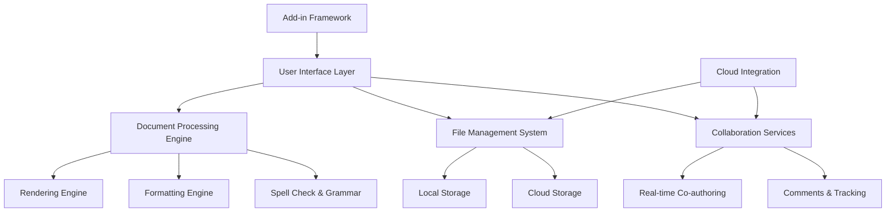

### Platform Support

Microsoft Word is designed to run on multiple platforms:

1. Windows Desktop Application
2. macOS Desktop Application
3. Web-based Application

### Key Features

| Feature Category | Description |
|------------------|-------------|
| Document Creation | Rich text editing, templates, styles |
| Formatting | Text styling, page layout, themes |
| Media Integration | Tables, images, charts, SmartArt |
| Collaboration | Real-time co-authoring, comments, track changes |
| File Management | Multiple format support, cloud storage integration |
| Advanced Tools | Mail merge, macros, add-ins |
| Accessibility | Screen reader support, accessibility checker |

### Integration Points

Microsoft Word integrates with various external systems and services:

1. Microsoft OneDrive and SharePoint for cloud storage and sharing
2. Microsoft Teams for enhanced collaboration
3. Microsoft Graph API for extensibility and third-party integrations
4. Operating system APIs for deep integration with Windows and macOS
5. Web browser technologies for the web-based version

### Security and Compliance

The system is designed with a strong focus on security and compliance:

- End-to-end encryption for document storage and transmission
- Multi-factor authentication support
- Compliance with GDPR, CCPA, and other data protection regulations
- Regular security audits and penetration testing

### Scalability and Performance

Microsoft Word is engineered to handle documents of various sizes and complexities:

- Efficient handling of large documents (up to 10,000 pages)
- Optimized for performance on a wide range of hardware configurations
- Cloud-based services designed to support millions of concurrent users

This system overview provides a high-level understanding of Microsoft Word's architecture, key components, and core functionalities. It serves as a foundation for the more detailed specifications that follow in the subsequent sections of this technical specification document.

# SYSTEM ARCHITECTURE

## PROGRAMMING LANGUAGES

Microsoft Word will be developed using a combination of programming languages, each chosen for its specific strengths and suitability for different components of the application. The following table outlines the primary languages to be used and their justifications:

| Language | Purpose | Justification |
|----------|---------|---------------|
| C++ | Core engine, performance-critical components | High performance, low-level control, cross-platform compatibility |
| C# | Windows desktop application, business logic | Strong integration with Windows APIs, productivity, type safety |
| Swift | macOS desktop application | Native macOS development, performance, modern language features |
| TypeScript | Web-based version, cross-platform scripting | Type safety, excellent tooling, wide browser support |
| JavaScript | Web-based version (client-side), add-ins | Universal browser support, rich ecosystem |
| Python | Automation scripts, tooling | Rapid development, extensive libraries for text processing |
| SQL | Database queries and management | Industry standard for relational database operations |

## HIGH-LEVEL ARCHITECTURE DIAGRAM

The following diagram provides an overview of Microsoft Word's high-level architecture:

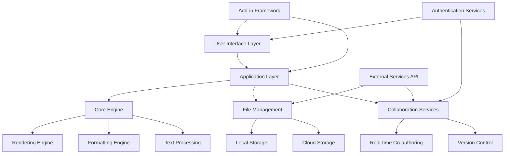

## COMPONENT DIAGRAMS

### Core Engine Components

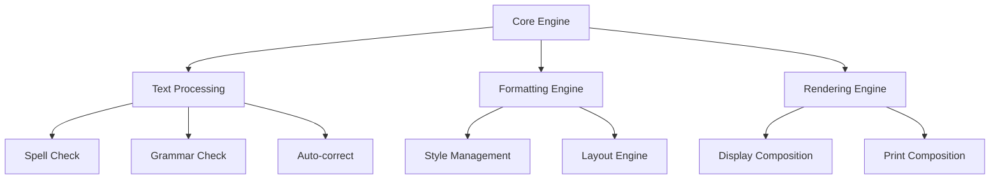

### File Management Components

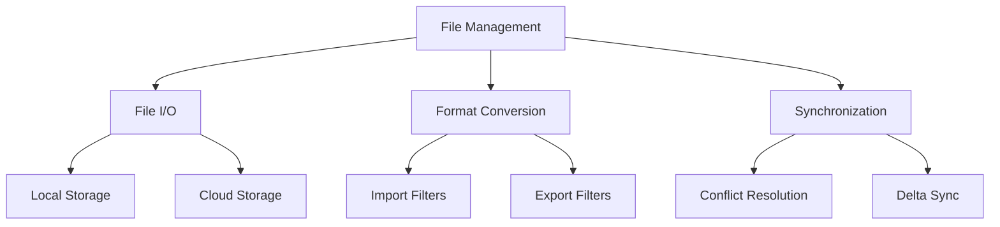

## SEQUENCE DIAGRAMS

### Document Opening Sequence

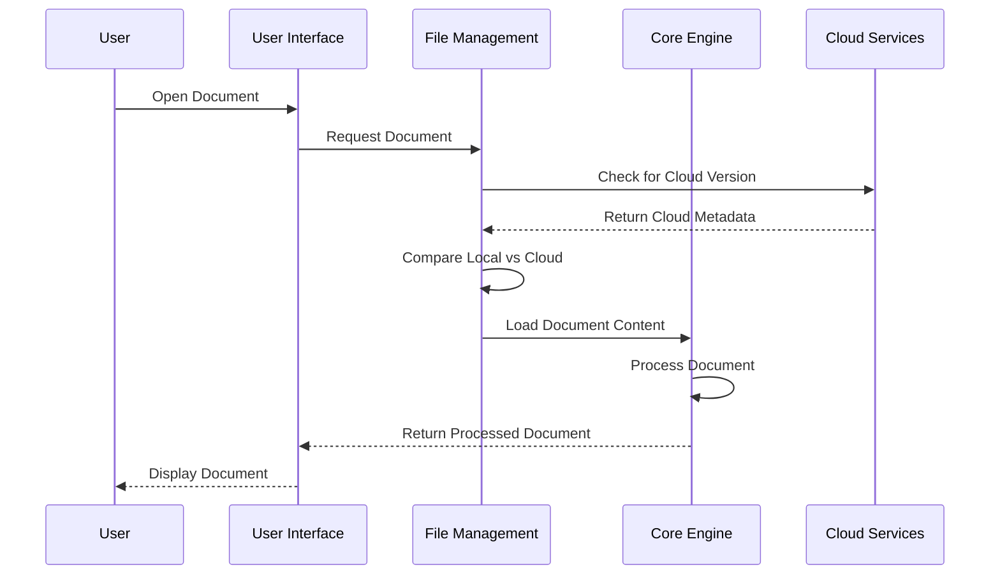

### Real-time Collaboration Sequence

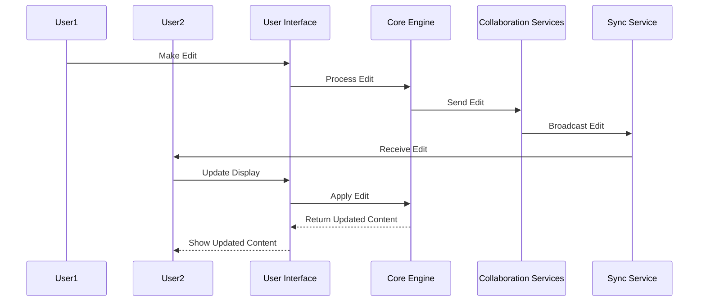

## DATA-FLOW DIAGRAM

The following diagram illustrates how data flows through the Microsoft Word system:

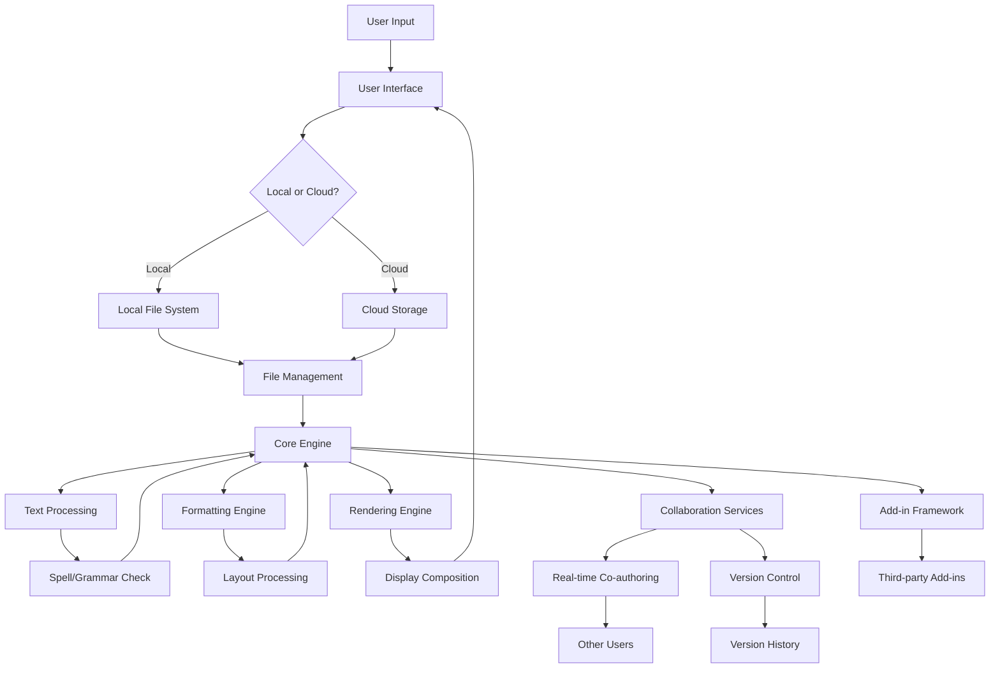

This data flow diagram shows how user input is processed through the system, from the user interface through file management, core processing, and collaboration services. It also illustrates the interaction with both local and cloud storage, as well as the integration of add-ins and version control.

The architecture described in this section is designed to support the cross-platform nature of Microsoft Word (Windows, macOS, and web-based versions) while maintaining consistency and performance across all platforms. The use of a shared core engine written in C++ allows for maximum performance and code reuse, while platform-specific languages (C# for Windows, Swift for macOS, and TypeScript/JavaScript for web) are used to create native user interfaces and platform-specific integrations.

# SYSTEM DESIGN

## PROGRAMMING LANGUAGES

Microsoft Word will be developed using a combination of programming languages, each chosen for its specific strengths and suitability for different components of the application. The following table outlines the primary languages to be used and their justifications:

| Language | Purpose | Justification |
|----------|---------|---------------|
| C++ | Core engine, performance-critical components | High performance, low-level control, cross-platform compatibility |
| C# | Windows desktop application, business logic | Strong integration with Windows APIs, productivity, type safety |
| Swift | macOS desktop application | Native macOS development, performance, modern language features |
| TypeScript | Web-based version, cross-platform scripting | Type safety, excellent tooling, wide browser support |
| JavaScript | Web-based version (client-side), add-ins | Universal browser support, rich ecosystem |
| Python | Automation scripts, tooling | Rapid development, extensive libraries for text processing |
| SQL | Database queries and management | Industry standard for relational database operations |

## DATABASE DESIGN

Microsoft Word primarily uses file-based storage for documents, but it also requires a database for managing user preferences, document metadata, and collaboration features. We will use a combination of relational and NoSQL databases to meet different requirements:

1. Relational Database (SQL Server for Windows, SQLite for local storage):

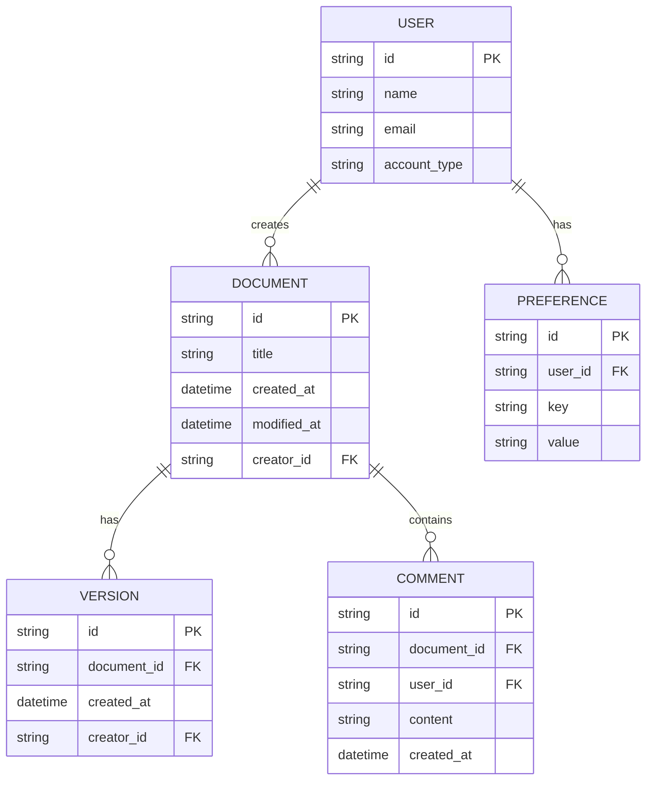

2. NoSQL Database (Azure Cosmos DB):
   - Used for storing document content and structure
   - Flexible schema to accommodate various document elements
   - High-performance read/write operations for real-time collaboration

## API DESIGN

Microsoft Word will implement a RESTful API for communication between the client applications and the backend services. The API will follow OpenAPI (Swagger) specifications for clear documentation and easy integration.

Key API endpoints:

1. Document Management:
   - GET /documents: Retrieve user's documents
   - POST /documents: Create a new document
   - GET /documents/{id}: Retrieve a specific document
   - PUT /documents/{id}: Update a document
   - DELETE /documents/{id}: Delete a document

2. Collaboration:
   - POST /documents/{id}/share: Share a document
   - GET /documents/{id}/comments: Retrieve comments for a document
   - POST /documents/{id}/comments: Add a comment to a document

3. Version Control:
   - GET /documents/{id}/versions: Retrieve version history
   - POST /documents/{id}/versions: Create a new version
   - PUT /documents/{id}/versions/{versionId}: Restore a specific version

4. User Management:
   - POST /users: Create a new user
   - GET /users/{id}: Retrieve user information
   - PUT /users/{id}: Update user information

5. Preferences:
   - GET /users/{id}/preferences: Retrieve user preferences
   - PUT /users/{id}/preferences: Update user preferences

Authentication will be handled using OAuth 2.0, with JWT tokens for secure API access.

## USER INTERFACE DESIGN

The user interface for Microsoft Word will be designed to be intuitive, efficient, and consistent across all platforms (Windows, macOS, and web). The UI will follow Microsoft's Fluent Design System principles.

Key UI components:

1. Ribbon Interface:
   - Tabbed interface for organizing features
   - Customizable Quick Access Toolbar

2. Document Editing Area:
   - WYSIWYG editing interface
   - Ruler and guidelines for precise layout control

3. Sidebar Panels:
   - Context-sensitive panels for additional functionality (e.g., styles, navigation)

4. Status Bar:
   - Document information and quick access to view settings

5. Dialog Boxes:
   - Modal windows for advanced settings and operations

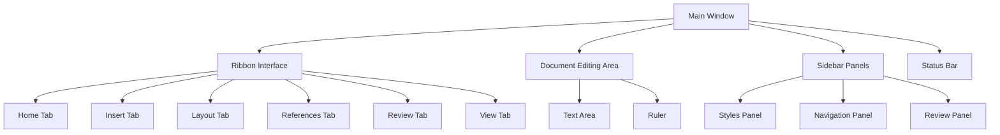

Accessibility Considerations:
- High contrast themes
- Keyboard navigation support
- Screen reader compatibility
- Customizable font sizes and color schemes

Responsive Design:
- Adaptive layout for different screen sizes
- Touch-friendly interface for mobile devices
- Consistent core functionality across platforms

The user interface will be implemented using platform-specific technologies:
- Windows: WPF (Windows Presentation Foundation) with XAML
- macOS: AppKit and SwiftUI
- Web: React.js with TypeScript for component-based UI development

This system design aligns with the previously mentioned technology choices, including the use of C++ for the core engine, C# and Swift for desktop applications, and TypeScript/JavaScript for the web-based version. The database design supports both local and cloud-based storage requirements, while the API design facilitates communication between different components of the system and enables integration with external services.

# TECHNOLOGY STACK

## PROGRAMMING LANGUAGES

The following programming languages will be used in the development of Microsoft Word:

| Language | Purpose | Justification |
|----------|---------|---------------|
| C++ | Core engine, performance-critical components | High performance, low-level control, cross-platform compatibility |
| C# | Windows desktop application | Strong integration with Windows APIs, productivity, type safety |
| Swift | macOS desktop application | Native macOS development, performance, modern language features |
| TypeScript | Web-based version, cross-platform scripting | Type safety, excellent tooling, wide browser support |
| JavaScript | Web-based version (client-side), add-ins | Universal browser support, rich ecosystem |
| Python | Automation scripts, tooling | Rapid development, extensive libraries for text processing |
| SQL | Database queries and management | Industry standard for relational database operations |

## FRAMEWORKS AND LIBRARIES

Microsoft Word will utilize the following frameworks and libraries:

| Framework/Library | Purpose | Justification |
|-------------------|---------|---------------|
| .NET Framework | Windows desktop application development | Comprehensive framework for Windows, extensive APIs |
| AppKit | macOS desktop application UI | Native macOS UI development, performance |
| React | Web-based version UI | Component-based architecture, efficient rendering, large ecosystem |
| Electron | Desktop application wrapper for web version | Cross-platform desktop applications using web technologies |
| Boost | C++ utility libraries | Extensive set of high-quality C++ libraries |
| OpenXML SDK | Office document format handling | Official Microsoft library for working with Office file formats |
| PDFsharp | PDF generation and manipulation | Open-source .NET library for PDF operations |
| Hunspell | Spell checking | Multi-language spell checking library |
| LanguageTool | Grammar checking | Open-source proofreading software for multiple languages |
| TensorFlow.js | Machine learning for text prediction | Powerful ML library for JavaScript, enables smart features |

## DATABASES

Microsoft Word will employ the following database systems:

| Database | Purpose | Justification |
|----------|---------|---------------|
| SQLite | Local storage for desktop applications | Lightweight, serverless, ideal for local document metadata |
| Azure SQL Database | Cloud-based relational database | Scalable, managed SQL database for user data and preferences |
| Azure Cosmos DB | NoSQL database for web version | Globally distributed, multi-model database for flexible schema |
| Redis | Caching layer | In-memory data structure store for high-performance caching |

## THIRD-PARTY SERVICES

The following external services and APIs will be integrated into Microsoft Word:

| Service/API | Purpose | Justification |
|-------------|---------|---------------|
| Microsoft Graph API | Integration with Microsoft 365 services | Unified API for accessing Microsoft cloud services |
| OneDrive API | Cloud storage and synchronization | Seamless integration with Microsoft's cloud storage solution |
| Azure Active Directory | User authentication and authorization | Enterprise-grade identity and access management |
| Bing Spell Check API | Enhanced spell checking | Cloud-based spell check service with machine learning capabilities |
| Azure Cognitive Services | AI-powered features (e.g., text analytics) | Advanced AI capabilities for enhanced document processing |
| SendGrid | Email notifications | Reliable email delivery for system notifications |
| Stripe | Payment processing for subscriptions | Secure and widely adopted payment processing platform |
| GitHub Actions | CI/CD pipeline | Automated building, testing, and deployment |

## TECHNOLOGY STACK DIAGRAM

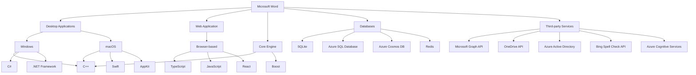

This technology stack is designed to support the cross-platform nature of Microsoft Word, leveraging appropriate technologies for each platform while maintaining a consistent core engine. The combination of high-performance languages like C++ for the core engine, platform-specific languages for native desktop applications, and web technologies for the browser-based version ensures optimal performance and user experience across all supported platforms.

# SECURITY CONSIDERATIONS

## AUTHENTICATION AND AUTHORIZATION

Microsoft Word implements a robust authentication and authorization system to ensure secure access to documents and features across all platforms (Windows, macOS, and web-based versions).

### Authentication

1. Microsoft Account Integration:
   - Users authenticate using their Microsoft Account credentials.
   - Support for single sign-on (SSO) across Microsoft services.

2. Multi-Factor Authentication (MFA):
   - Optional but strongly encouraged for all user accounts.
   - Supports various second factors: SMS, authenticator apps, hardware tokens.

3. OAuth 2.0 Implementation:
   - Used for secure authorization of third-party integrations and add-ins.
   - Follows the latest OAuth 2.0 security best practices.

4. Enterprise Authentication:
   - Integration with Azure Active Directory for enterprise users.
   - Support for SAML 2.0 for federated authentication with enterprise identity providers.

### Authorization

1. Role-Based Access Control (RBAC):
   - Predefined roles: Owner, Editor, Reviewer, Viewer.
   - Custom roles can be defined for enterprise customers.

2. Document-Level Permissions:
   - Granular control over document access and editing rights.
   - Supports time-based access expiration.

3. Feature-Based Authorization:
   - Certain features (e.g., macros, add-ins) can be restricted based on user roles or admin policies.

4. Conditional Access:
   - Integration with Azure AD Conditional Access for enterprise customers.
   - Allows for policy-based access control (e.g., device compliance, location-based restrictions).

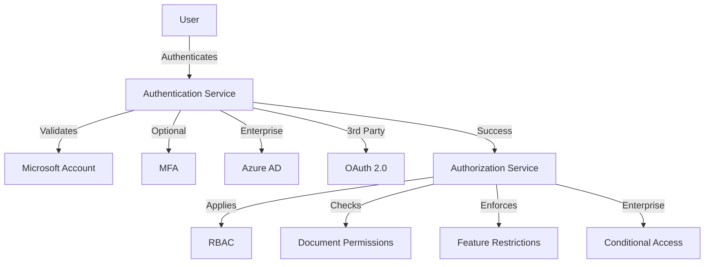

## DATA SECURITY

Microsoft Word implements comprehensive data security measures to protect user information and document content:

1. Encryption:
   - At Rest: AES 256-bit encryption for all stored documents.
   - In Transit: TLS 1.3 for all network communications.

2. Data Classification:
   - Automatic classification of documents based on content sensitivity.
   - Integration with Microsoft Information Protection for enterprise customers.

3. Data Loss Prevention (DLP):
   - Built-in DLP policies to prevent sharing of sensitive information.
   - Custom DLP rules can be defined by enterprise administrators.

4. Secure Temporary Files:
   - Temporary files are encrypted and stored in protected locations.
   - Automatic deletion of temporary files after use.

5. Metadata Scrubbing:
   - Option to remove personal metadata before sharing documents.

6. Secure Collaboration:
   - End-to-end encryption for real-time co-authoring sessions.
   - Encrypted comments and tracked changes.

7. Backup and Recovery:
   - Encrypted backups of user data and documents.
   - Secure, versioned recovery options.

8. Data Isolation:
   - Strict data isolation in multi-tenant environments.
   - Separate storage and processing for enterprise customers.

| Data State | Encryption Method | Key Management |
|------------|-------------------|----------------|
| At Rest | AES 256-bit | Azure Key Vault |
| In Transit | TLS 1.3 | Managed PKI |
| In Use | Secure Enclaves (where available) | Hardware-based keys |

## SECURITY PROTOCOLS

Microsoft Word adheres to industry-standard security protocols and implements additional measures to ensure system-wide security:

1. Secure Development Lifecycle (SDL):
   - Follows Microsoft's SDL practices throughout the development process.
   - Regular security training for development team members.

2. Vulnerability Management:
   - Continuous vulnerability scanning of codebase and dependencies.
   - Integration with Microsoft's bug bounty program.

3. Patch Management:
   - Regular security updates and patches.
   - Automatic updates for end-users with configurable policies for enterprises.

4. Audit Logging:
   - Comprehensive logging of security-relevant events.
   - Secure, tamper-evident log storage.

5. Incident Response:
   - Established incident response plan with defined roles and procedures.
   - Integration with Microsoft's global security operations center.

6. Penetration Testing:
   - Regular internal and third-party penetration testing.
   - Simulated attack scenarios to test security measures.

7. Compliance:
   - Adherence to ISO 27001, SOC 2, and other relevant security standards.
   - Regular compliance audits and certifications.

8. Third-Party Security:
   - Strict security requirements for third-party integrations and add-ins.
   - Regular security assessments of integrated services.

9. Hardware Security:
   - Support for hardware security modules (HSM) for enterprise deployments.
   - Integration with Trusted Platform Module (TPM) for enhanced security on compatible devices.

10. AI/ML Security:
    - Secure implementation of AI features (e.g., text prediction, content analysis).
    - Privacy-preserving machine learning techniques to protect user data.

```mermaid
graph TD
    A[Security Protocols] --> B[Secure Development]
    A --> C[Vulnerability Management]
    A --> D[Patch Management]
    A --> E[Audit Logging]
    A --> F[Incident Response]
    A --> G[Penetration Testing]
    A --> H[Compliance]
    A --> I[Third-Party Security]
    A --> J[Hardware Security]
    A --> K[AI/ML Security]
    B --> L[SDL Practices]
    B --> M[Security Training]
    C --> N[Vulnerability Scanning]
    C --> O[Bug Bounty Program]
    D --> P[Regular Updates]
    D --> Q[Automatic Patching]
    E --> R[Event Logging]
    E --> S[Secure Storage]
    F --> T[Response Plan]
    F --> U[Security Operations]
    G --> V[Internal Testing]
    G --> W[Third-Party Testing]
    H --> X[ISO 27001]
    H --> Y[SOC 2]
    I --> Z[Integration Requirements]
    I --> AA[Service Assessments]
    J --> AB[HSM Support]
    J --> AC[TPM Integration]
    K --> AD[Secure AI Implementation]
    K --> AE[Privacy-Preserving ML]
```

These security considerations are designed to provide a comprehensive and robust security framework for Microsoft Word, ensuring the confidentiality, integrity, and availability of user data and documents across all supported platforms. The measures described are consistent with the previously mentioned technology choices, including the use of Microsoft Azure services for cloud integration, and support for various operating systems and web browsers.